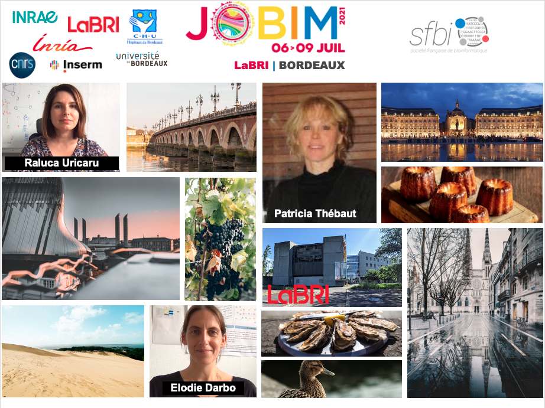
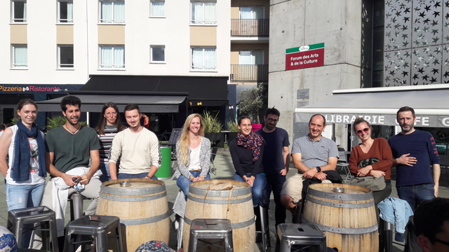

### JOBIM2021@Bordeaux - Evénement local

La conférence des Journées Ouvertes en Biologie, Informatique et Mathématiques (JOBIM) sera organisée exclusivement à distance du 06 au 09 Juillet [https://jobim2021.sciencesconf.org/](https://jobim2021.sciencesconf.org/).

Cette conférence donne l'occasion, depuis deux dizaines d'années, à la communauté bioinfomatique française de se réunir et d'échanger. 
Jobim 2021 a été une conférence virtuelle pour la deuxième année consécutive, mais le comité d'organisation 2021 a souhaité cette année là y mettre un peu de convivialité grâce à des événements locaux organisés dans plusieurs villes de France:
- pour assister aux conférences à plusieurs sur grand écran
- et organiser des activités sociales (en ligne) le mercredi 7 juillet en fin de journée
Nous avons répondu présents à cet appel du comité d'organisation 2021 pour que Bordeaux puisse être une des villes en lien avec l'organisation semi-distanciel de JoBIM 2021.

L'idée était de projeter les conférences dans l'amphi du LaBRI et de discuter autour d'un café lors des pauses. 

Nous étions 21 participants à ce JOBIM décentralisé sur Bordeaux. Une très bonne ambience et le plaisir de se retrouver au rendez-vous ! 

Merci à tou·te·s

